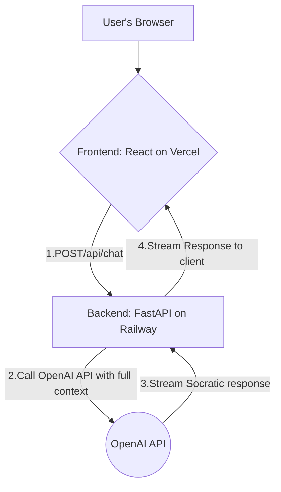

### **Project Overview: Rubby the Duck**

---

### 1. Project Goal & Core Problem

**Project Goal:** To build a conversational AI learning companion named "Rubby the Duck" that guides users to deeper understanding through the Socratic method, fostering critical thinking and self-discovery.
**Core Problem:** Traditional learning often involves passive consumption of information (reading, watching videos) or seeking direct answers, which leads to shallow knowledge. Learners lack a patient, non-judgmental partner to help them articulate their thoughts, challenge their own assumptions, and build lasting comprehension from the ground up.

---

### 2. MVP Scope & Key Features

**Features IN Scope for MVP (Week 15 Demo):**
*   **Conversational AI Core:** A web-based chat interface for interacting with Rubby.
*   **Session-based Memory:** The AI will remember the context of the current conversation to ask relevant follow-up questions.
*   **Socratic Dialogue Engine:** The core feature where the AI responds with guiding questions instead of answers.
*   **Voice & Text Input:** Users can interact via speech-to-text or by typing.
*   **"I'm Stuck" Mechanism:** A feature to get a hint or a rephrased question.
*   **Essential UX:** A friendly character persona, clear onboarding, and loading indicators.
*   **Basic Accessibility:** Screen reader compatibility for core navigation and chat.

**Features OUT of Scope for MVP:**
*   User Accounts & Authentication.
*   Persistent Storage (saving conversation history across sessions).
*   Advanced animations or character customization.
*   Long-term progress tracking or learning dashboards.
*   Multi-language support.
*   Monetization or subscription features.

---

### 3. Target Audience

The primary target users are **students, developers, and lifelong learners** who are tackling complex or abstract topics. They are motivated to achieve genuine understanding, not just find a quick answer, and would benefit from a guided, interactive thinking process.

---

### 4. Technology Stack (Specific Versions)

| Category | Technology | Specific Version | Notes |
| :--- | :--- | :--- | :--- |
| Language | Python | 3.11.4 | For the backend service. |
| Backend Framework | FastAPI | 0.110.0 | Chosen for async support, ideal for streaming responses. |
| Frontend Framework | React | 18.2.0 | Using Vite for the build tool. |
| AI API Library | OpenAI Python | 1.17.0 | For interacting with GPT-4o and GPT-4o-mini. |
| Testing (Backend) | Pytest | 8.1.1 | For unit and integration tests. |
| Testing (Frontend) | Vitest | 1.5.0 | For component unit tests. |
| Deployment (Frontend) | Vercel | N/A | Connected to GitHub for CI/CD. |
| Deployment (Backend)| Railway | N/A | Free tier is sufficient for this project's needs. |
| Version Control | Git | N/A | Repository hosted on GitHub. |

---

### 5. High-Level Architecture

**Architectural Style:** A stateless, client-server web application. The backend serves as an orchestrator, managing conversation context and making calls to the third-party AI service.

**Mermaid Diagram:**


---

### 6. Core Components/Modules

*   **Frontend:** Renders the chat UI, manages client-side state (the current conversation history, loading status, voice input status), and communicates with the backend API.
*   **Backend:** Exposes the `/api/chat` endpoint. It receives the conversation history, constructs a new prompt using the system prompt and history, selects the appropriate AI model (mini or full), and streams the response back.
*   **AI Service Module (Backend):** A dedicated Python module that contains all logic for interacting with the OpenAI API, including model selection, prompt construction, and cost/token logging.

---

### 7. Key UI/UX Considerations

*   **Conversational Interface:** The entire user experience is centered around a simple, clean, and encouraging chat interface.
*   **Persona-Driven Design:** The UI, color palette, and micro-interactions should all reinforce Rubby's supportive and friendly persona.
*   **Focus & Minimalism:** The interface must be free of clutter to help the user concentrate on their thinking process.
*   **Responsive Design:** The UI must be fully functional on both desktop and mobile devices.

---

### 8. Coding Standards & Quality Criteria

*   **Style Guide:** PEP 8 for Python; Airbnb JavaScript Style Guide for React.
*   **Formatter:** Black (Python); Prettier (JavaScript/React).
*   **Linter:** Ruff (Python); ESLint (JavaScript/React).
*   **Top 5 Quality Criteria Focus:** User Experience, Reliability, Cost-Efficiency, Accessibility, Maintainability.

---

### 9. Testing Strategy

*   **Required Test Types:** Unit Tests, Integration Tests, Manual End-to-End Tests, Accessibility Audits.
*   **Testing Frameworks:** `pytest 8.1.1` (Backend), `Vitest 1.5.0` (Frontend).
*   **Minimum Code Coverage:** 80% for the core backend AI Service Module.
*   **Verification Approach:** A GitHub Actions workflow will run all linters and automated tests on every pull request, blocking merges if any checks fail.

---

### 10. Initial Setup Steps
```bash
# 1. Clone the repository
git clone https://github.com/anrj/rubby.git
cd rubby

# 2. Set up the backend
cd backend
python -m venv venv
source venv/bin/activate
pip install -r requirements.txt
cp .env.example .env
# Edit .env and add your OPENAI_API_KEY

# 3. Set up the frontend
cd ../frontend
npm install

# 4. Run the application (in two separate terminals)
# Terminal 1 (from /backend):
uvicorn app.main:app --reload
# Terminal 2 (from /frontend):
npm run dev
```

---

### 11. Key Architectural Decisions

*   **Backend Framework (FastAPI):** Chosen over Flask for its native `async` support and performance, which is essential for efficiently streaming AI responses and creating a responsive, conversational feel.
*   **Stateless Backend (for MVP):** We deliberately chose to avoid a database for the MVP. The client is responsible for sending the entire conversation history with each request, which simplifies the backend architecture and allows us to focus on the AI logic.
*   **Hybrid AI Model Strategy (GPT-4o-mini / GPT-4o):** Chosen to drastically reduce operational costs. The cheaper `mini` model handles the bulk of the conversation, while the more powerful `4o` model is reserved for more complex situations, providing the best balance of quality and cost.

---

### 12. Project Documentation

*   **Project Overview (This Doc):** `docs/prd-full`
*   **Architecture Diagram & Details:** `docs/architecture.md`
*   **Prioritized Backlog:** `docs/backlog.md`
*   **Evaluation Plan:** `docs/evaluation-plan.md`
*   **Cost Model:** `docs/cost-model.md`
*   **Team Health Checks:** `docs/team-health.md`
*   **Team Contract:** `docs/team-contract.md`

---

### 13. Repository Link

`https://github.com/anrj/rubby.git`

---

### 14. Dependencies & Third-Party Services

*   **OpenAI API:** The core dependency for all generative AI features. Requires an API key.
    *   **Services Used:** GPT-4o-mini (primary), GPT-4o (secondary).
    *   **Rate Limits:** We will operate within the default Tier 1 limits, which are more than sufficient for our needs.
*   **Vercel:** Hosting platform for our React frontend (free tier).
*   **Railway:** Hosting platform for our FastAPI backend (free tier).

---

### 15. Security Considerations

*   **Authentication Method:** None for the MVP. The application is public and ephemeral.
*   **Data Protection:** No user data or PII is stored on our servers. All conversation sessions are temporary and exist only on the client side during use.
*   **Key Security Risks & Mitigations:**
    *   **API Key Theft:** Mitigated by storing the OpenAI key exclusively in a secure environment variable on the backend server (Railway). The key is never exposed to the client-side application.
    *   **Prompt Injection:** Mitigated through a strong system prompt that defines Rubby's behavior and by having no sensitive data or functions for the AI to access or leak.
    *   **Denial of Service (Cost Overruns):** Mitigated by active, daily monitoring of our OpenAI usage dashboard and implementing cost alerts as defined in our cost model.

---

### 16. Performance Requirements

*   **Response Time (Text):** The API must deliver the first token of a Socratic response in **< 2 seconds (p95)**.
*   **Voice-to-Text Latency:** Transcription of user speech must appear in the UI in **< 3 seconds (p95)** after the user stops speaking.
*   **Resource Constraints:** The application must operate entirely within the free tiers of Vercel and Railway. The total OpenAI API cost must stay within our allocated budget ($10 goal, $30 hard limit).

---

### 17. Monitoring & Observability

*   **Logging Strategy:** Structured JSON logs for all backend API requests, capturing the model used, token counts (prompt and completion), latency, and calculated cost for each individual AI call.
*   **Monitoring Tools:** We will use the built-in dashboards on Vercel and Railway to monitor server health, uptime, and basic traffic. The OpenAI dashboard is our primary tool for real-time cost and API usage monitoring.
*   **Key Metrics:** API latency (p95), cost per conversation, daily API spend, and server error rates (5xx).

---

### 18. Deployment & DevOps

*   **Deployment Strategy:** A continuous deployment (CD) workflow. Any merge into the `main` branch on GitHub will automatically trigger a new deployment on both Vercel (frontend) and Railway (backend).
*   **Environment Strategy:**
    *   **Development:** Local machines (`localhost`).
    *   **Staging:** Vercel provides automatic preview deployments for every pull request, which we will use as our staging environment.
    *   **Production:** The live application deployed from the `main` branch.
*   **CI/CD Pipeline:** A GitHub Actions workflow is configured to run linters (Ruff, ESLint) and all unit tests (`pytest`, `Vitest`) on every pull request. Merging to `main` is blocked if any of these checks fail.