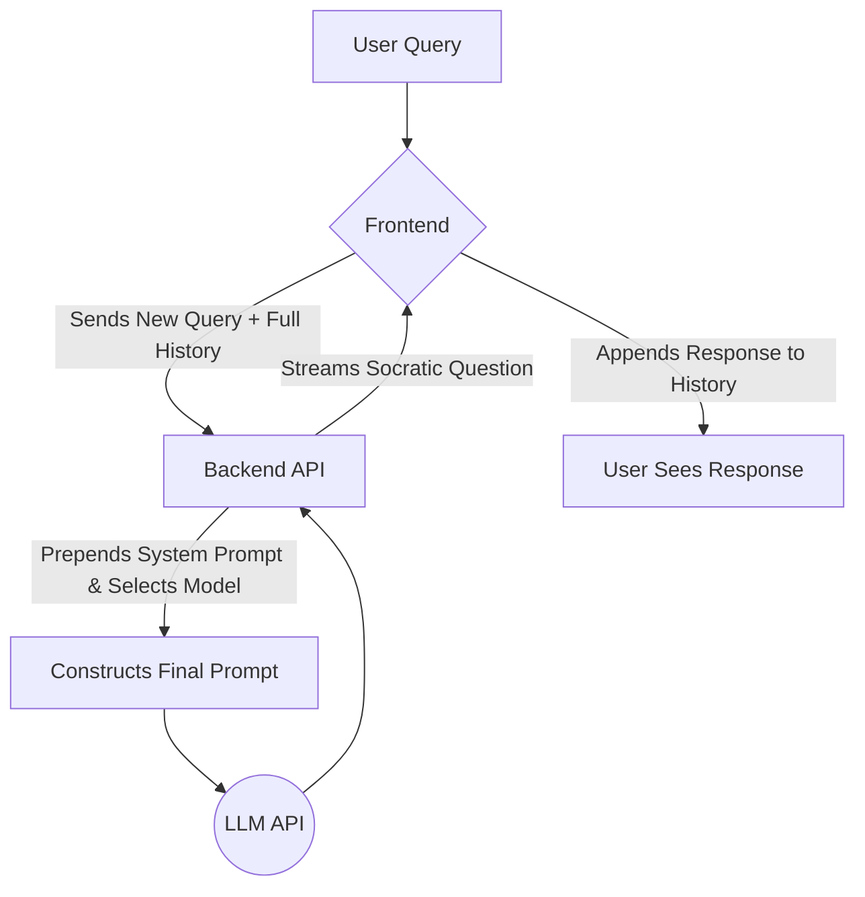

### **RAG Strategy**

**Team Name:** Rubby the Duck
**Project:** Rubby the Duck
**Date:** Week 6, 11/6/2025

---
### 1. Do We Need RAG?

**Decision:** ☐ YES, we're using RAG | ☒ **NO, we're not using RAG (for the MVP)**

**Reasoning:**
Our MVP for Rubby the Duck is designed to be a **Socratic learning partner**, not a knowledge retrieval system. Its primary function is to help users explore their *own* understanding and internal knowledge through guided questioning. The "knowledge" it requires is the short-term memory of the current conversation, which is handled by passing the chat history with each API call.

Retrieval-Augmented Generation (RAG) is a powerful technique for querying an existing corpus of documents. This could be a valuable feature in a future "Run" or "Fly" phase (e.g., allowing a user to upload a textbook chapter and have Rubby guide them through it). However, for the MVP, implementing a RAG pipeline would introduce significant complexity (embedding, vector storage, chunking) without contributing to our core goal of demonstrating a high-quality, persona-driven, Socratic dialogue. Our chosen alternative is more direct and appropriate for this specific use case.

---
### 2. Knowledge Sources

This section is not applicable for the MVP, as we are not using a static knowledge base. However, for future planning ("Run" phase), the following sources would be integrated:

**Future Source 1: User's Study Materials**
- **Type:** PDF, Markdown (`.md`), and Plain Text (`.txt`) documents.
- **Location:** User-uploaded files.
- **Quantity:** Varies per user (e.g., 1-10 documents per study session).
- **Update Frequency:** Varies; updated by the user for each new topic.
- **Content Description:** A user's lecture notes, textbook chapters, or articles on a topic they want to understand more deeply.

---
### 3. RAG Architecture Choice

Since we are not implementing RAG for the MVP, we are using an alternative architecture.

☐ Option A: Traditional RAG
☐ Option B: Database RAG
☐ Option C: Hybrid RAG
☒ **Option D (Modified): No RAG (Contextual Conversation)**
```
User Query → Append to History → Inject History into Prompt → LLM → Socratic Question
```
**Our reasoning for choosing this:**
This is the most direct and efficient architecture for our Socratic learning use case. The core challenge is maintaining a coherent, empathetic, and intelligent conversation, which depends entirely on the immediate context of the chat history, not on retrieving external documents. This approach allows us to focus our effort on prompt engineering and conversational flow, which are the most critical factors for the success of the MVP.

---
### 4. Technical Implementation

This section is not applicable for the MVP. However, for the future "Run" phase, our planned RAG stack is:
*   **Embedding Model:** `text-embedding-3-small` for its excellent balance of cost and performance.
*   **Vector Database:** `Chroma` for local development, with a plan to use a serverless option like `Vercel Postgres` with the `pg_vector` extension in production to stay within a modern web ecosystem.
*   **Chunking Strategy:** `RecursiveCharacterTextSplitter` with 800 token chunks and a 150 token overlap to maintain semantic context within study materials.
*   **Retrieval Parameters:** Start with `Top K = 3` to provide focused context for Rubby's questions without overwhelming the prompt.

---
### 5. Citation Strategy

Not applicable for the MVP. Rubby the Duck generates original questions to provoke thought and does not cite external sources.

---
### 6. RAG Evaluation Plan

Not applicable for the MVP. The quality of our conversational context is evaluated via our main **Evaluation Plan**, specifically through the "memory test" cases in our Golden Set and through qualitative user testing, where we will ask users if Rubby seemed to "remember" earlier parts of the conversation.

---
### 7. Alternative Approaches (If Not Using RAG)

#### How We're Accessing Knowledge/Data Instead
Our application's only "knowledge" is the conversation itself. We use a **Contextual Conversation** pattern:
1.  The frontend React application maintains the full list of messages (user and AI) for the current session in its client-side state.
2.  When the user sends a new message, the entire chat history is sent to our backend API.
3.  The backend takes this history, combines it with our carefully engineered system prompt (which defines Rubby's persona and rules), and sends it as a single, context-rich package to the LLM.
4.  This allows the LLM to "remember" the user's previous statements, track their line of reasoning, and generate Socratic questions that are coherent and relevant to the ongoing dialogue.

#### Why This Is Better for Our Project (for the MVP)
*   **Aligns with Core Goal:** Our goal is to facilitate self-discovery, not information retrieval. Conversational context is the fuel for this process.
*   **Reduces Complexity:** It completely eliminates the need for a RAG pipeline (ingestion, chunking, embedding, vector storage), which is a significant engineering effort.
*   **Lower Cost for MVP:** We avoid the costs associated with embedding tokens and paying for a managed vector database service.
*   **Focuses Effort:** It allows us to concentrate 100% of our energy on what truly matters for this project: the quality of the prompt engineering, Rubby's persona, and the logical flow of the Socratic dialogue.

---
### 8. Implementation Timeline

Not applicable for a RAG-specific implementation. The implementation of our Contextual Conversation pattern is part of our core feature development from Week 5 to Week 8, as outlined in our prioritized backlog.

---
### 9. Risks and Mitigations (for our chosen Contextual Conversation approach)

#### Risk 1: Exceeding Context Window
**Symptom:** In very long learning sessions, the conversation history grows too large, and API calls begin to fail with a "context window exceeded" error.
**Mitigation:**
- [x] **Implement Smart Truncation:** The backend will use the `tiktoken` library to calculate the token count of the history before sending it to the API. It will automatically remove the oldest messages (keeping the system prompt and the most recent turns) to ensure the payload always fits within the model's limit (e.g., 8K tokens for GPT-4o-mini).

#### Risk 2: High Costs in Long Sessions
**Symptom:** As the conversation history grows, the input token count for every single turn increases, driving up the cost of the session.
**Mitigation:**
- [x] **Hybrid Model Selection:** This is our primary mitigation. By using the extremely cheap GPT-4o-mini for 90% of turns, we keep the cost of long conversations manageable. The expensive GPT-4o is used sparingly.
- [ ] **(Future) Conversation Summarization:** For a post-MVP version, we could implement a function where, after a certain number of turns, a cheaper model summarizes the early part of the conversation, preserving its key points with far fewer tokens.

---
### 10. Resources and References

**Libraries/Tools We're Using:**
*   `openai` Python SDK: For all interactions with the GPT models.
*   `tiktoken`: To accurately count tokens for our truncation logic and for precise cost logging.

**Team Members Responsible:**
*   Context Management: Nikoloz Tukhashvili (Backend Lead)
*   Prompt Engineering: Anri Javakhishvili (AI Integration)
*   Evaluation: All team members.

---
### Appendix: Contextual Conversation Architecture Diagram

---
### Sign-off

**Team Members:**
- Giorgi Gogichashvili

**Date Completed:** 11/6/2025